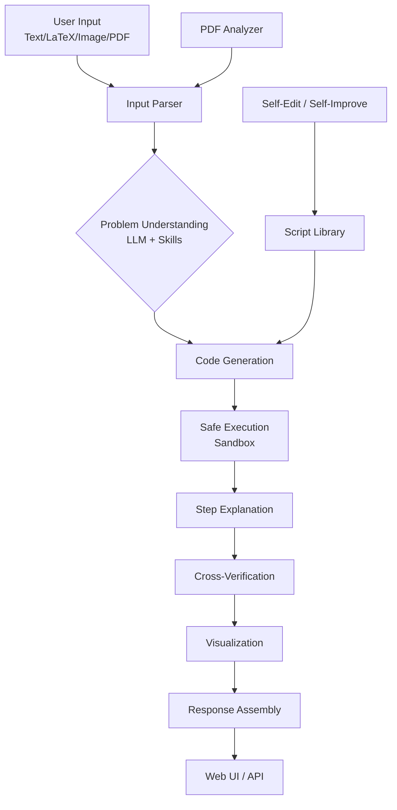
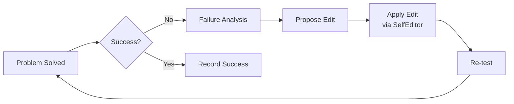

# MathEngine System Architecture

**Date**: 2026-02-10  
**Version**: 1.0  
**Project**: MathEngine (math-engine)  
**Base Directory**: e:/projects/math-engine

## 1. Overview

MathEngine is a comprehensive math tutoring system that combines symbolic computation, LLM‑driven code generation, step‑by‑step explanations, cross‑verification, and a modern web interface. The architecture follows a modular pipeline where each component has a distinct responsibility, enabling flexibility, testability, and future enhancements.

## 2. High‑Level Architecture



## 3. Component Details

### 3.1 Input Layer (`backend/input/`)
- **InputParser**: Converts raw user input into canonical LaTeX.
  - `text_to_latex()`: Heuristic and regex‑based conversion.
  - `image_to_latex()`: Uses `pix2tex` (LaTeX OCR) to extract equations.
  - `pdf_to_latex()`: Extracts math‑rich sections from PDFs via PyMuPDF.
- **Supported Input Types**: Plain text, LaTeX, image (PNG/JPG), PDF.

### 3.2 LLM Layer (`backend/llm/`)
- **Provider Abstraction**: `BaseLLMProvider` with concrete implementations for Gemini, Claude, DeepSeek, OpenAI.
- **Key Methods**:
  - `understand_problem()`: Returns problem category, description, and suggested approach.
  - `generate_solver_code()`: Produces executable Python code that solves the problem.
  - `explain_steps()`: Generates student‑friendly explanations for each step.
- **API Key Management**: Environment variables + runtime configuration.

### 3.3 Core Engine (`backend/core/`)
#### `MathEngine` (Orchestrator)
- Coordinates the entire pipeline: parse → understand → generate → execute → explain → verify → visualize.
- Integrates all sub‑components (executor, verifier, explainer, visualizer, self‑edit, skills).

#### `SafeExecutor`
- **Sandboxed Execution**: Restricts built‑ins and imports to a whitelist (SymPy, NumPy, SciPy, mpmath).
- **AST Validation**: Blocks dangerous operations (`exec`, `eval`, `open`).
- **Timeout Handling**: Prevents infinite loops.
- **Result Extraction**: Captures `_result`, `_steps`, `_plots` from executed code.

#### `CrossVerifier`
- **Multi‑Library Verification**: Runs the same computation using SymPy, NumPy/SciPy, and mpmath.
- **Consensus Checking**: Compares results across libraries; flags discrepancies.
- **Tolerance Handling**: Numerical tolerance for floating‑point differences.

#### `StepExplainer`
- **LLM‑Driven Explanations**: Converts raw Python steps into student‑friendly narratives.
- **LaTeX Generation**: Produces LaTeX for each step.
- **Fallback**: If LLM fails, returns raw step data.

#### `MathVisualizer`
- **Plot Generation**: Uses Matplotlib to create function plots, contour maps, etc.
- **UI Integration**: Saves plots as PNG, returns URL for frontend display.

#### `SelfEditor`
- **File‑Based Editing**: Modifies Python scripts in the script library based on failure analysis.
- **Workspace Awareness**: Knows the project layout; can edit, create, or delete files.

#### `SelfImprover`
- **Failure Analysis**: Examines execution errors and verification mismatches.
- **Improvement Loop**: Proposes edits, applies them via `SelfEditor`, re‑tests.
- **Learning**: Builds a memory of past failures and successful fixes.

### 3.4 Script Library (`backend/scripts/`)
- **LibraryManager**: Indexes and searches Python scripts by problem signature.
- **Populate Scripts**: Pre‑written templates for common math domains (quadratic solver, derivative basic, etc.).
- **Skill Matching**: `SkillRegistry` matches problem statements to predefined skill templates, guiding LLM code generation.

### 3.5 Skills System (`backend/skills/`)
- **Skill Registry**: Loads skill definitions from `skills/` directory.
- **Template‑Based Guidance**: Each skill provides a code template and prompting hints.
- **Integration**: Informs LLM about available skills, improving code generation reliability.

### 3.6 API Layer (`backend/api/`)
- **FastAPI Application**: REST endpoints for solving, chatting, PDF analysis, etc.
- **Models**: Pydantic models for request/response validation (`SolveRequest`, `SolveResponse`, etc.).
- **Routes**:
  - `POST /solve`: Main solving endpoint.
  - `POST /chat`: Conversational interface.
  - `POST /analyze-pdf`: PDF extraction and solving.
  - `GET /library`: Browse script library.
  - `POST /self‑edit`: Trigger self‑editing manually.

### 3.7 Frontend (`frontend/`)
- **Framework**: React + TypeScript, Vite, TailwindCSS, shadcn/ui.
- **Pages**:
  - `Solver`: Main solving interface with input, steps, visualizations.
  - `Papers`: Research‑paper extraction and editing (OpenClaw‑like edit feature).
  - `SelfEvolution`: Dashboard for monitoring self‑improvement cycles.
  - `History`: Past solutions.
  - `Settings`: API key configuration.
- **Components**:
  - `MathRenderer`: LaTeX rendering via KaTeX.
  - `ChatSidebar`: Conversational interface.
  - `VisualizationViewer`: Displays generated plots.
- **State Management**: React hooks + TanStack Query for API calls.

### 3.8 Testing Infrastructure (`test/`)
- **Unit Tests**: `test_engine.py`, `test_comprehensive.py`, `test_detailed.py`, etc.
- **Sample Problems**: `sample‑text‑problems/`, `sample‑image‑problems/`, `sample‑research‑papers/`.
- **Test Results**: JSON‑structured reports in `test‑results/`.
- **Coverage**: `pytest‑cov` for code coverage tracking.

## 4. Data Flow

1. **User submits problem** (text, LaTeX, image, or PDF) via UI or API.
2. **Input Parser** converts to LaTeX; if PDF, extracts math sections.
3. **LLM + Skills**:
   - LLM understands problem, suggests category.
   - Skill registry matches problem to a template (if any).
4. **Code Generation**: LLM produces Python code using skill template guidance.
5. **Safe Execution**: Code runs in sandbox; results and intermediate steps captured.
6. **Step Explanation**: LLM (or fallback) explains each step in student‑friendly language.
7. **Cross‑Verification**: Same computation repeated with SymPy, NumPy, mpmath; results compared.
8. **Visualization**: If requested, plots are generated.
9. **Response Assembly**: All data packaged into `SolveResponse`.
10. **UI Presentation**: Steps, explanations, verification results, plots displayed.

## 5. Self‑Evolution Loop



- **Failure Detection**: Execution errors, verification mismatches, user feedback.
- **Edit Generation**: LLM suggests code changes to fix the issue.
- **Application**: `SelfEditor` modifies the relevant script in the library.
- **Validation**: Problem is re‑solved; loop continues until success.

## 6. Deployment Architecture

- **Backend**: FastAPI server (Uvicorn) on port 8000.
- **Frontend**: Vite dev server on port 5173; in production, built static files served by FastAPI or Nginx.
- **Environment**: Conda environment `mathengine` with dependencies from `environment.yml`.
- **External Dependencies**:
  - LLM APIs (Gemini, Claude, DeepSeek, OpenAI)
  - Pix2Tex (image‑to‑LaTeX)
  - PyMuPDF (PDF extraction)

## 7. Key Design Decisions

1. **LLM as Code Generator, Not Solver**: Ensures mathematical correctness stems from trusted libraries (SymPy, NumPy) rather than LLM hallucinations.
2. **Multi‑Library Verification**: Increases confidence in results; detects library‑specific bugs.
3. **Sandboxed Execution**: Security critical when executing arbitrary LLM‑generated code.
4. **Skill‑Based Guidance**: Improves code generation consistency by providing templates for known problem types.
5. **Self‑Editing**: Allows the system to improve its own script library, reducing manual maintenance.
6. **Modular Pipeline**: Each component can be tested, replaced, or extended independently.

## 8. Known Limitations & Future Improvements

| Area | Limitation | Planned Improvement |
|------|------------|----------------------|
| Image OCR | Pix2Tex dependency issues; handwriting recognition poor. | Integrate alternative OCR engines; add preprocessing. |
| PDF Extraction | PyMuPDF environment conflicts. | Move to containerized extraction service. |
| LLM Latency | Code generation can be slow. | Cache generated code for similar problems. |
| Frontend‑Backend Sync | Visualization images not always displayed. | Implement WebSocket progress streaming. |
| Self‑Edit Safety | Edits could introduce bugs. | Add test suite before accepting edits. |
| Coverage | Some math domains (topology, abstract algebra) under‑tested. | Expand script library and test suite. |

## 9. Directory Structure

```
e:/projects/math‑engine/
├── backend/
│   ├── core/           # Core engine components
│   ├── input/          # Input parsing
│   ├── llm/            # LLM providers
│   ├── scripts/        # Script library & manager
│   ├── skills/         # Skill definitions
│   ├── api/            # FastAPI routes & models
│   ├── pdf/            # PDF analysis
│   └── main.py         # Server entry point
├── frontend/           # React app
├── test/               # Test suites & sample data
├── outputs/            # Generated plots, logs
├── plans/              # Planning documents
├── architecture.md     # This document
├── feature‑analysis.md # Feature completion analysis
└── README.md           # Project overview
```

## 10. Update Log

| Date | Version | Changes |
|------|---------|---------|
| 2026‑02‑10 | 1.0 | Initial architecture document created. |

---

*This document will be updated as the architecture evolves.*